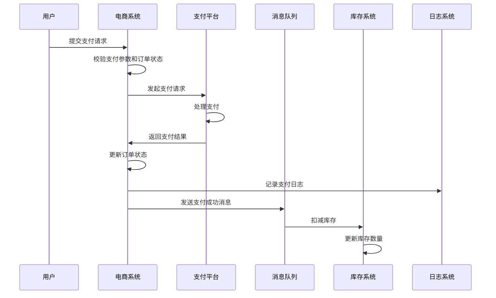

# 技术方案输出模板（第3步）

## 技术方案输出原则

**触发时机**：用户确认了技术方案大纲后

**行为要求**：

1. 根据已确认的需求、技术方案大纲，生成完整的技术方案
2. 必须包含每个模块的需求简述
3. 必须包含每个模块的技术实现描述
4. 必须包含每个模块的技术实现时序图
5. 必须包含每个模块的技术核心实现步骤


## 技术实现描述生成的核心原则

基于已拆分好的实现步骤，生成一段**逻辑清晰、详略得当**的摘要段落，放在"技术实现步骤"之前作为总览。

**生成规则：**

1. **叙述为主，阶段为辅**：不要机械地写"分X个阶段"，改用流畅的业务语言描述流程起点→过程→终点
2. **核心动作必须覆盖**：每个步骤的关键动作都要在描述中有所体现
4. **使用业务术语**：如"调起支付"、"回调验签"、"更新状态"、"异步通知"，避免技术组件名
5. **紧凑的动作链表达**：用分号（；）或箭头（→）衔接各步骤，避免"首先/随后/最终"等口语化过渡词，保持技术文档的专业感
6. **字数控制**：80-150字，允许1-2句话适当展开关键细节

---


## 技术实现时序图生成的核心原则

- 所有业务模块都需要 Mermaid 时序图描述交互流程
- 参与者必须是业务角色/系统，不是技术组件
- 正确示例：用户、电商系统、支付平台、库存系统
- 错误示例：UserController、OrderServiceImpl

---


## 技术实现步骤生成的核心原则

### 1. 以业务事件为起点
- 使用业务术语描述起点："用户下单"、"订单支付"、"订单取消"
- 避免底层技术动作："调用接口"、"查询数据库"、"发送MQ"

### 2. 以数据流为核心，标注技术细节
每个步骤必须明确回答三个问题：
- **数据从哪来？**（具体表名、查询条件、接口地址、消息主题）
- **怎么处理？**（业务规则、字段校验、状态流转）
- **到哪里去？**（具体表名、变更字段、消息主题）

**技术标注要求**：
- 数据查询：写出表名 + 查询条件（where 字段 = ?） + 返回的核心字段
- 数据变更：写出表名 + 修改的字段及新值 + 影响范围
- 接口调用：写出接口地址 + 请求/响应核心字段
- 消息发送：写出消息主题/标签 + 消息体核心字段
- **不允许**出现 Controller/Service/DAO 类名和方法名

### 3. 详细描述业务规则与技术约束
- 明确列出具体的业务规则与字段校验规则（如字段长度、枚举值、唯一性）
- 描述分支逻辑（如果...则...否则...）
- 包含边界条件处理与异常场景
- 状态流转需要明确写出状态的转换路径（如：待支付 → 已支付）

### 4. 数据范围标记要求
- **每个模块的首个步骤**：必须标注涉及的数据表、核心字段、接口或消息主题
  - **同时必须标注代码修改范围**：入口项目名/文件名/函数（格式：`项目名#文件名.扩展名#函数名()`），以及禁止修改的核心逻辑
- **后续步骤**：如果涉及新的表或接口，同样需要标注

### 5. 检查清单

生成实现步骤后，请对照以下清单检查：

- ✅ 每个步骤都有明确的数据来源和去向
- ✅ 包含了具体的业务规则
- ✅ 描述了分支逻辑
- ✅ 每个模块都标注了涉及的数据表、字段、接口或消息主题
- ✅ 每个模块的首个步骤都标注了代码修改范围（项目/文件/函数）
- ✅ 每个业务模块都有 Mermaid 时序图
- ✅ 包含了边界条件处理

---


### 6. 电商订单支付流程示例

#### 技术实现描述

用户提交支付请求后，校验订单状态与支付参数（已支付则直接拦截）；调起第三方渠道完成扣款；接收回调并验签防伪造；同步更新订单状态与记录支付流水；最终通过消息队列异步驱动库存扣减与物流履约，完成支付闭环。


#### 时序图



#### 技术核心实现步骤

**第 1 步：处理支付请求 - 校验支付参数，准备支付**
- 实现逻辑：
  1. 接收支付请求：用户选择支付方式并提交支付表单
     - 涉及字段：支付方式（pay_type：1-支付宝/2-微信）、支付金额（amount）、订单号（order_no）
  2. 校验支付参数：验证金额、订单号、支付方式是否有效
     - 业务规则：amount > 0、order_no 非空、pay_type 枚举值在 [1,2] 范围内
  3. 校验订单状态：查询订单表确认订单是否存在且未支付
     - 数据查询：order_table（条件：order_no = ?，返回：status 字段）
     - 业务规则：订单状态 ≠ 已支付
     - 分支逻辑：若订单已支付，返回"订单已支付"错误；若订单不存在，返回"订单不存在"错误
  4. 调用第三方支付接口：根据支付方式调起相应支付渠道完成预下单
     - 外部接口：支付宝/微信预下单接口（请求：order_no, amount, pay_type；返回：支付表单/pay_url）
     - 分支逻辑：若支付接口调用失败，记录失败日志并返回"支付调起失败"错误，终止流程
- **涉及数据范围**：
  - 数据表：order_table（查询字段：order_no、status）
  - 外部接口：支付宝/微信支付预下单接口
- **代码修改范围**：
  - 入口项目/文件/函数：order-service#PaymentController.java#processPayment()
  - 禁止修改核心逻辑：订单状态更新逻辑（由第2步回调处理）
- **边界条件处理**：
  - 支付请求超时：设置合理的超时时间（如 30s），超时后提示用户重试
  - 支付参数验证失败：返回具体的参数错误信息（如"金额不能为0"）
  - 重复支付：幂等校验，已支付订单直接拦截

**第 2 步：处理支付结果通知 - 更新订单状态，记录支付日志**
- 实现逻辑：
  1. 接收支付结果通知：第三方支付渠道通过回调接口通知支付结果
     - 回调入参：order_no、pay_no（第三方流水号）、pay_time、pay_status（SUCCESS/FAIL）
  2. 验证通知真实性：校验回调签名，防止伪造通知
     - 校验规则：使用商户密钥对参数排序后计算签名，与回调中的 sign 字段比对
  3. 更新订单状态：根据支付结果同步更新订单表
     - 数据变更：order_table（条件：order_no = ?，更新：status = '已支付', payment_time = 当前时间, payment_channel = pay_type, pay_no = ?）
     - 状态流转：待支付 → 已支付
  4. 记录支付日志：写入支付流水表
     - 数据变更：payment_record（插入字段：order_no, payment_channel, amount, payment_time, pay_no, status = '成功'）
- **涉及数据范围**：
  - 数据表：order_table（更新字段：status、payment_time、payment_channel、pay_no）、payment_record（插入字段：order_no、payment_channel、amount、payment_time、pay_no、status）

**第 3 步：发送支付成功消息 - 通知其他系统订单已支付**
- 实现逻辑：
  1. 发送支付成功消息：向消息队列发送订单支付成功事件
     - 消息主题：order.paid
     - 消息体：order_no、user_id、amount、pay_time
  2. 库存系统消费消息：扣减对应商品库存
     - 数据变更：stock_table（条件：sku_id = ?，更新：available_stock = available_stock - quantity）
  3. 物流系统消费消息：开始处理订单履约
     - 数据变更：logistics_task（插入字段：order_no、user_id、status = '待发货'、create_time）
- **涉及数据范围**：
  - 消息：topic = order.paid（字段：order_no、user_id、amount、pay_time）
  - 数据表：stock_table（更新字段：available_stock）、logistics_task（插入字段：order_no、user_id、status、create_time）

---


## **技术方案文档结构**

生成的技术方案文档包含以下章节（数据模型、接口为可选，仅在方案中有内容时才输出）：

````
# {{projectName}} - 技术方案

## 文档信息

| 版本号 | 修订日期 | 修订状态 | 修订者 | 说明 |
|--------|----------|----------|--------|------|
| {{version}} | {{date}} | A | {{author}} | {{changeDesc}} |

> A-增加  M-修改  D-删减

---

## 一、需求背景

### 1.2 需求范围

**要实现的功能：**

{{featureList}}

---

## 二、技术方案模块

### 2.1 {{module1Name}}

#### 2.1.2 技术实现描述

{{techSummary}}

#### 2.1.1 时序图

```mermaid
{{sequenceDiagram}}
```

#### 2.1.3 技术实现步骤

{{steps}}

---

## 三、数据模型

### 3.1 表结构

#### {{tableName1}}

| 字段中文说明 | 字段名 | 字段类型 | 注释 | 是否必填 | 关键字段约束 |
|--------|--------|----------|--------------|--------------|--------------|
| ID | id | BIGINT(20) | 主键，雪花算法生成 | Y | 主键（PK），非空 |
| {{fields1}} |||||||

**索引**

| 索引类型 | 字段 | 索引名称           |
| -------- | ---- | ------------------ |
| 主键索引 | id   | pk_{{tableName1}}_id |

**分区**

| 字段 | 字段说明 | 分区类型 | 分区数量 |
| ---- | -------- | -------- | -------- |
|      |          |          |          |

---

## 四、接口

### 4.1 接口列表

| 序号 | 接口名称     | 接口地址                         | 说明         |
| ---- | ------------ | -------------------------------- | ------------ |
| 1    | {{apiName1}} | POST /api/{{module}}/{{action1}} | {{apiDesc1}} |

### 4.2 接口详情

#### 1. {{apiName1}}

##### 描述
{{api1Desc}}

##### 请求Method
POST，application/json

##### 请求URI
/api/{{module}}/{{action1}}

##### 请求Body
| 参数名称   | 必填 | 类型    | 长度 | 描述信息       |
| ---------- | ---- | ------- | ---- | -------------- |
| {{param1}} | 是   | String  |      | {{param1Desc}} |
| {{param2}} | 否   | Integer |      | {{param2Desc}} |


##### 错误码
| 错误码 | 说明       |
| ------ | ---------- |
| 200    | 成功       |
| 400    | 参数错误   |
| 500    | 服务器错误 |

---

_（当响应Data中包含嵌套对象时，**必须使用单独的表格**描述该对象）_

_ (分页信息入参模板)
参数名称	必填	类型	长度	描述信息
pageInfo	O	PageInfo		分页信息

_ (分页信息响应模板)
参数名称	必填	类型	长度	描述信息
list	O	List<{{嵌套对象}}>		技能列表
nextPageCursor	O	String		下一页起始资源标识符，最后一页该值为空
totalCount	O	Int		记录总数，默认不返回。

_（注：`{{ }}` 中的内容为占位符，实际使用时请替换为具体项目信息。）_

````

